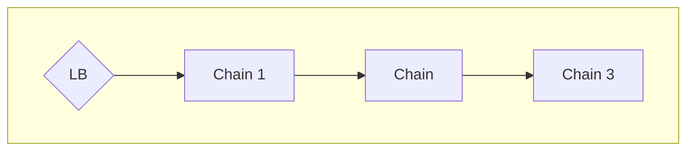
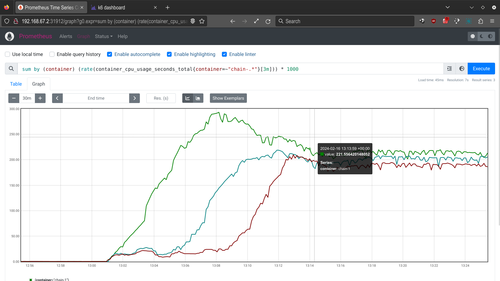
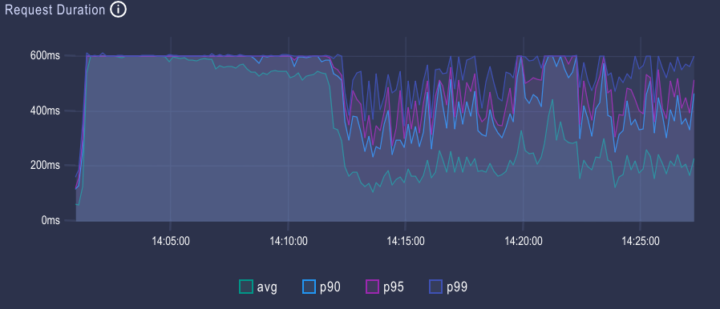
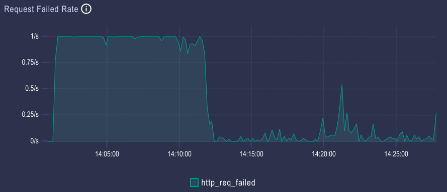

# Kubernetes Horizontal Autoscaling Benchmark

This repo contains the info and code for reproducing the HPA chain benchmark. In this benchmark
there are 3 microservices, `Chain-1`, `Chain-2` and `Chain-3`, connected into a cascade
topology. Test traffic is entering via the the Loadbalancer `LB` and a simple Kubernetes HPA is
acting on each microservice.



## TL;DR 

As HPA is scaling each microseservice independently, as per the local load experienced by the
microservice, it will start to scale only when all preceding microservices in the chain have
finished scaling.



This causes HTTP requests to time out until there is at least one microservice that is being scaled.





## Setup 

### Chainer

Chainer is a simple CPU load generator that you can use to run the microservices. The app takes the
CPU time to burn per each request (`CHAINER_LOAD_PER_REQUEST`) and the address of the next service
to call in the chain (`CHAINER_NEXT_SERVICE`) (empty means no next service).

Create the microservice graph with 3 `chainer` deployments:

``` console
kubectl apply -f chainer/deploy/chain-3.yaml
```

With the default setting, each call at each `chainer` instance takes roughly 10ms of CPU time and each pod
is limited to 100mcore CPU.

### HPA

Make sure the Kubernetes metrics server is running. For instance, in Minikube:

``` console
minikube -p hpa addons enable metrics-server
```

Setup HPA to scale each microservice for a 80% target CPU utilization:

``` console
kubectl apply -f chainer/deploy/hpa.yaml
```

### Monitoring

Set up Prometheus:

``` console
helm repo add prometheus-community https://prometheus-community.github.io/helm-charts
helm repo update
helm upgrade --install prometheus --set server.global.scrape_interval=15s --set server.global.evaluation_interval=15s prometheus-community/prometheus 
helm install prometheus-adapter prometheus-community/prometheus-adapter
kubectl expose service prometheus-server --type=LoadBalancer --port 9090 --target-port=9090 --name=prometheus
```

The following Prometheus queries can be used to monitor the workload:
- CPU [mcore] grouped by microservice:
  ```
  sum by (container) (rate(container_cpu_usage_seconds_total{container=~"chain-.*"}[3m])) * 1000
  ```
- success rate grouped by microservice:
  ```
  sum by (app) (rate(http_response_success_total[3m]))
  ```
- error rate grouped by microservice:
  ```
  sum by (app) (rate(http_response_error_total[3m]))
  ```

The below will store the external IP of the Prometheus service:

``` console
export PROMETHEUS_IP=$(kubectl get svc -l "app.kubernetes.io/component=server,app.kubernetes.io/instance=prometheus,app.kubernetes.io/name=prometheus" -o jsonpath={.items[0].status.loadBalancer.ingress[0].ip})
```

For a fancier visualization, install Grafana:

``` console
helm repo add grafana https://grafana.github.io/helm-charts
helm install grafana grafana/grafana
kubectl expose deployment grafana --type=LoadBalancer --port 3000 --target-port=3000
```

The Grafana password

``` console
kubectl get secret --namespace default grafana -o jsonpath="{.data.admin-password}" | base64 --decode ; echo
```

### Load generator

Set up [k6](https://k6.io):

``` console
cd k6
xk6 build latest # --with github.com/grafana/xk6-dashboard
```

Run the benchmark:

``` console
CHAINER_IP=$(kubectl get svc -l app=chain-1 -o jsonpath={.items[0].status.loadBalancer.ingress[0].ip}) K6_WEB_DASHBOARD=true K6_WEB_DASHBOARD_EXPORT=html-report.html ./k6 run script.js
```
